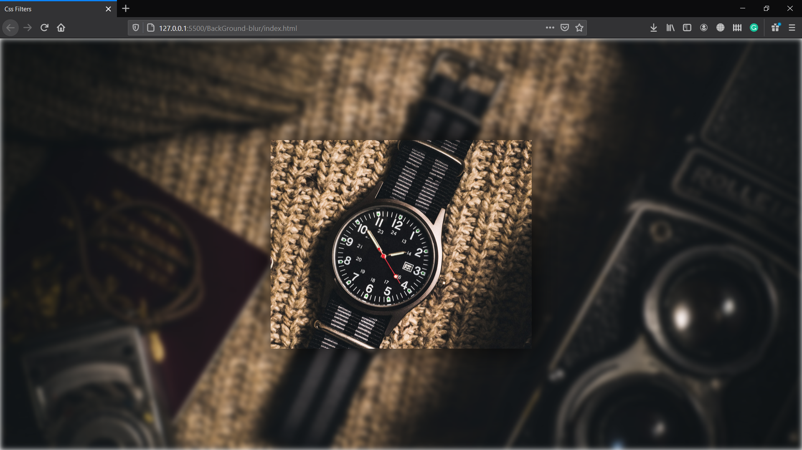

## BackGround Blur

css property used is "filter : blur()" takes px or rem or em value.

Note : It will be applied on all its child as well so make a separate div out of box.

##### Normal

##### On Hover

### Styling another div on hover?

Yes one can do that, but only if #b is after #a in the HTML.
If #b comes immediately after #a

#a:hover + #b {
background: #ccc
}

Div A

Div B

That's using the adjacent sibling combinator (+).

If there are other elements between #a and #b.

#a:hover ~ #b {
background: #ccc
}

Div A

random other elements

random other elements

random other elements

Div B

That's using the general sibling combinator (~).

Both + and ~ work in all modern browsers and IE7+

If #b is a descendant of #a, you can simply use #a:hover #b.
