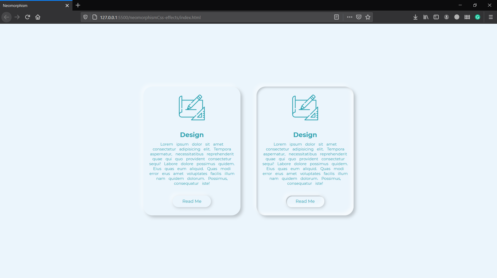
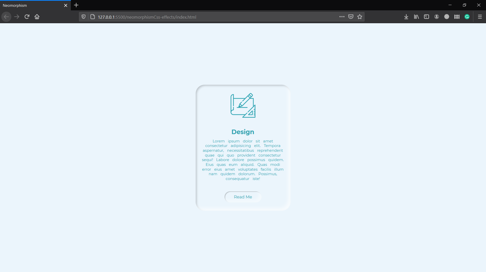

## Simple Neomorphism Effect On Card

Achieved this using box shadow
Note : You cannot apply transition from nroaml box-shadow to inset or visa-versa

### Normal

### Hover On Card

### Hover On Card Plus Read Me

